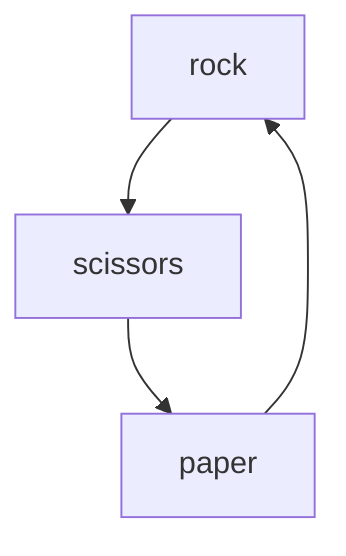

# rock-paper-scissors
~~I don't know yet!~~
Project ideation: use pseudocode or straight up thinking about it by breaking the project (aka big problem) into smaller, easier to solve little problems. Also, T.O.P. is giving out the answer straight up in the question (or assignment)! Let's try not to look at that... from what I recall, they are asking us to implement a browser version of the game "Rock, Paper, Scissors" but **without a GUI**. However, **I would like a GUI!** They said they'd be teaching how to build that later, and this whole DOM thing really does look intimidating to me, but lets just "grep" whatever code we need to make a simple "Rock, Paper, Scissors" game implementation that *at least* appears on the page, and allows interaction with the user, so they can actually play the game!  

## The Problem At Hand
### What fundamentally is "Rock, Paper, Scissors"?
It's a silly, dumb children's game that probably comes from that whole `JO-KEN-PO` thing (which is obviously in japanese, the greatest non-computer language of all time), as we play it like this in Brazil (actually verbalizing the words in the cringiest way possible) and it involves two players. Their possible moves are:


And `rock` "breaks" `scissors`. That then "cuts" `paper`, which finally "wraps around" a `rock`. *Ad infinitum*. It'll rotate like that. So, as we are playing against the browser, (T.O.P. said it: I've no clue how one's to play against a *browser*, but that's where `JS` runs so yeah). We need to get the computer's move. It would only have 3 choices. Therefore, it can choose between 0, 1, 2 or 1, 2 or 3 (or 2, 3, 4 and even 3, 4, 5 if I stop to think about it). 0, 1 and 2 sounds weird but okay. How can a computer choose? JavaScript can't do operations on *words* per se, so it's numbers and *"Welcome to programming, lad! Remember math? WELL HERE IT IS* and all the rest of it. I'm already rebuilding my math (which is somewhat decent) by literally watching videos by Khan Academy on how to **count**. Moving on, the computer chooses. Through numbers. I've learned in "C++ Primer" how to iterate through numbers sequentially through increments, but that's all I know for now. Let's try to build an ***RNG***.  

>We'll be sure to hard-code unfathomably unfair probabilities in our RNGs in the future so we can get back at Black Desert Online for being such jerks with their RNG implementations that broke all my stuff. *Sigh.* Okay.  

1. Implement random number generation using JavaScript  
a. How?
[Like this.](https://developer.mozilla.org/en-US/docs/Web/JavaScript/Reference/Global_Objects/Math/random)

```
function RNG(range) {
  return Math.floor(Math.random() * range);
}
```
MDN is awesome. Anyway, as far as I can tell, `Math.floor()`'s a sort of "truncator". A function is defined with `range` as a parameter. We will call that with `3` as an argument. Apparently, generating values between 0 inclusive and 1 exclusive and multiplying them by `range` will always net us random values, from 0 all the way up to `range` exclusive. That's because it'll generate 2.9999999999999 or whatever, which is not exactly 3. However, the **amount** of **entities** we have available to work with are **three, discrete numbers** which fit our needs perfectly. Now it's time for our move.  

2. Get user's move.
I'm tempted to just use `prompt()` xDDDDDD how's that for my *great GUI*... That'll let the user play just fine for now. Let's leave it at that. What? Yes, of course I'm adding some flair to it.

3. Throw user's move against computer's move at maximum speed  
This is going to require `if...else` statements, flow control and stuff. Assign `0`, `1` and `2` to their corresponding `rock`, `paper`, `scissors` game moves for readability...  
```
const ROCK = 0; // 33.33% chance of winning? probably not
const PAPER = 1;
const SCISSORS = 2;
```  
4. Maybe user inputs `Rock`, `rock` or `PaPeR` or `AAAAAAAAAAAAa`.  
a. PROPOSAL: Handle `AAAAAAAAAAAAa` and whatever other irregularities (cAsE, spaces).

5. Game logic (see item 3).
